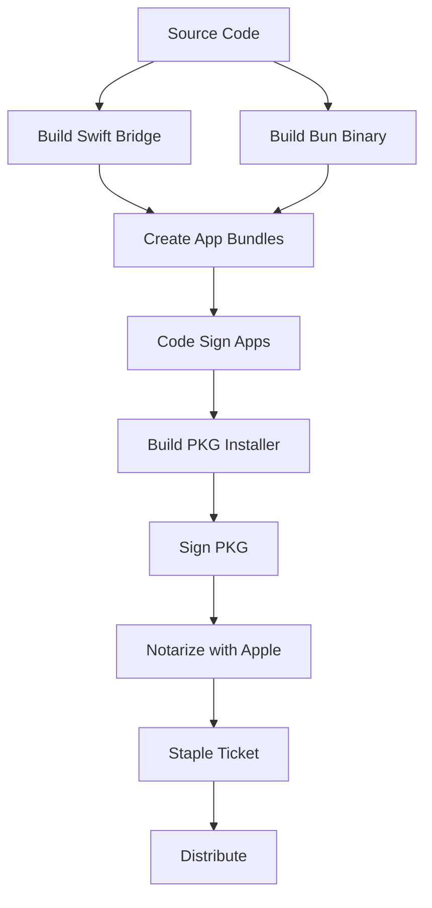
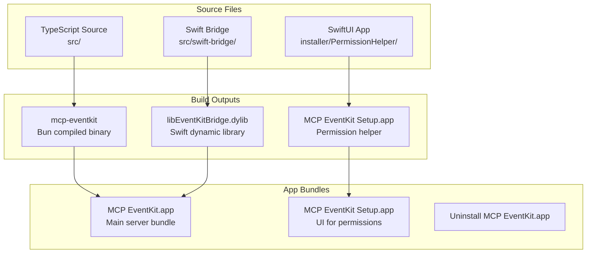
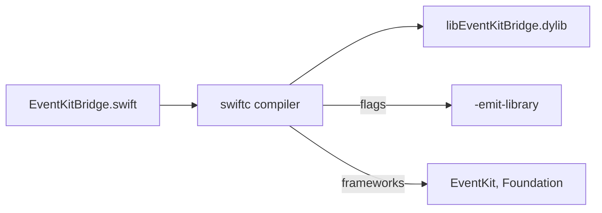
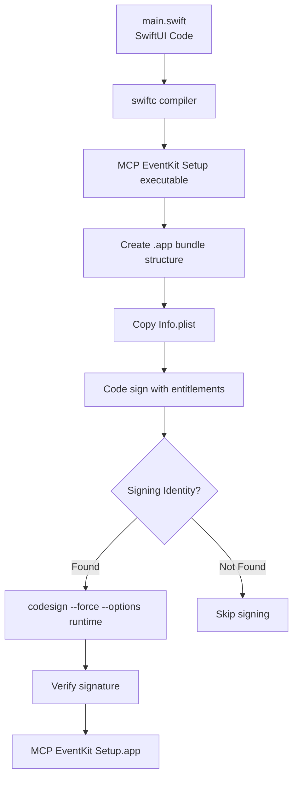
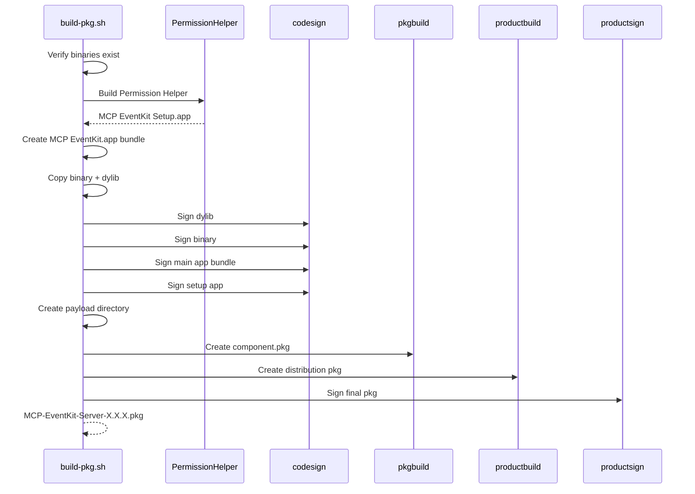
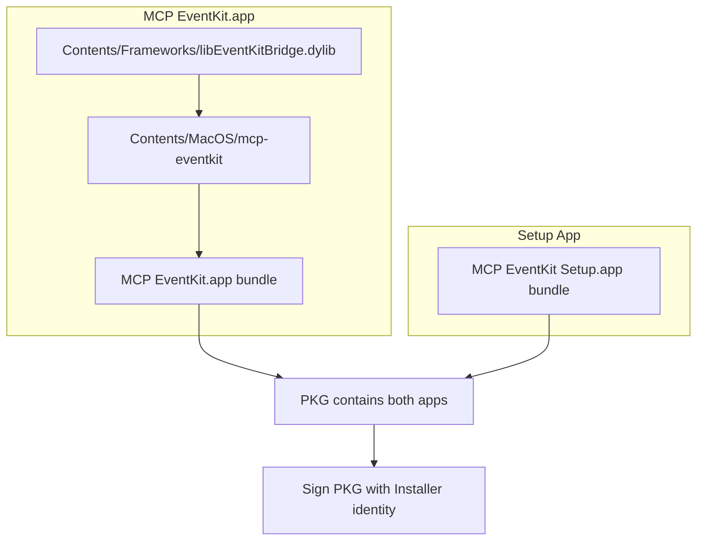
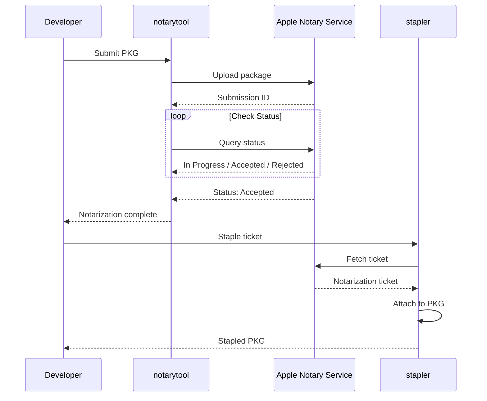
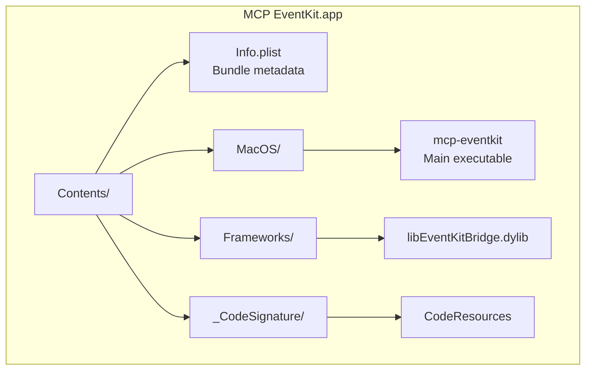

# Build, Sign, and Notarize Guide

This document describes the complete process to build, sign, notarize, and distribute the MCP EventKit Server installer package.

## Overview



## Prerequisites

### Required Tools
- **Xcode Command Line Tools**: `xcode-select --install`
- **Bun**: JavaScript runtime for building the server
- **Swift**: For compiling the EventKit bridge and SwiftUI apps
- **Apple Developer Account**: For code signing and notarization

### Required Certificates
You need these certificates installed in your Keychain:

| Certificate | Purpose |
|-------------|---------|
| Developer ID Application | Signs app bundles (.app) |
| Developer ID Installer | Signs installer packages (.pkg) |

### Required Entitlements
The `installer/entitlements.plist` file contains:

```xml
<?xml version="1.0" encoding="UTF-8"?>
<!DOCTYPE plist PUBLIC "-//Apple//DTD PLIST 1.0//EN" "...">
<plist version="1.0">
<dict>
    <!-- Code execution permissions -->
    <key>com.apple.security.cs.allow-jit</key>
    <true/>
    <key>com.apple.security.cs.allow-unsigned-executable-memory</key>
    <true/>
    <key>com.apple.security.cs.disable-library-validation</key>
    <true/>
    
    <!-- EventKit permissions (required for calendar/reminders access) -->
    <key>com.apple.security.personal-information.calendars</key>
    <true/>
    <key>com.apple.security.personal-information.reminders</key>
    <true/>
</dict>
</plist>
```

## Build Process

### Architecture



### Step 1: Build Swift Bridge

```bash
./src/swift-bridge/build.sh
```

This compiles `EventKitBridge.swift` into `libEventKitBridge.dylib`:



### Step 2: Build Bun Binary

```bash
bun build --compile --outfile build/mcp-eventkit src/index.ts
```

Creates a standalone executable that includes the Bun runtime.

### Step 3: Build Permission Helper App

```bash
./installer/PermissionHelper/build.sh
```

Process:



### Step 4: Build Complete Installer

```bash
./installer/build-pkg.sh 0.1.2
```

This orchestrates the entire build:



## Code Signing

### Signing Identity

Set via environment variable or hardcoded in scripts:

```bash
export APP_SIGN_IDENTITY="Developer ID Application: Your Name (TEAM_ID)"
export PKG_SIGN_IDENTITY="Developer ID Installer: Your Name (TEAM_ID)"
```

### Signing Order

Components must be signed from inside out:



### Signing Commands

```bash
# Sign dynamic library
codesign --force --options runtime --timestamp \
    --entitlements entitlements.plist \
    --sign "$APP_SIGN_IDENTITY" \
    "MCP EventKit.app/Contents/Frameworks/libEventKitBridge.dylib"

# Sign main executable
codesign --force --options runtime --timestamp \
    --entitlements entitlements.plist \
    --sign "$APP_SIGN_IDENTITY" \
    "MCP EventKit.app/Contents/MacOS/mcp-eventkit"

# Sign app bundle
codesign --force --options runtime --timestamp \
    --entitlements entitlements.plist \
    --sign "$APP_SIGN_IDENTITY" \
    "MCP EventKit.app"

# Verify signature
codesign --verify --deep --strict "MCP EventKit.app"
```

## Notarization

### Process Flow



### Notarization Commands

```bash
# Submit for notarization
xcrun notarytool submit dist/MCP-EventKit-Server-0.1.2.pkg \
    --apple-id "your@email.com" \
    --team-id "TEAM_ID" \
    --password "app-specific-password" \
    --wait

# Staple the notarization ticket
xcrun stapler staple dist/MCP-EventKit-Server-0.1.2.pkg
```

### Store Credentials (Optional)

Save credentials to Keychain for convenience:

```bash
xcrun notarytool store-credentials "notary-profile" \
    --apple-id "your@email.com" \
    --team-id "TEAM_ID" \
    --password "app-specific-password"

# Then use:
xcrun notarytool submit dist/package.pkg \
    --keychain-profile "notary-profile" \
    --wait
```

## Package Structure

### Final PKG Contents

```
MCP-EventKit-Server-0.1.2.pkg
├── Distribution (XML manifest)
├── Resources/
│   ├── welcome.html
│   └── conclusion.html
└── component.pkg
    └── Payload/
        ├── Applications/
        │   ├── MCP EventKit.app/
        │   │   ├── Contents/
        │   │   │   ├── Info.plist
        │   │   │   ├── MacOS/
        │   │   │   │   └── mcp-eventkit
        │   │   │   ├── Frameworks/
        │   │   │   │   └── libEventKitBridge.dylib
        │   │   │   └── _CodeSignature/
        │   │   └── ...
        │   ├── MCP EventKit Setup.app/
        │   └── Uninstall MCP EventKit.app/
        └── Scripts/
            └── postinstall
```

### App Bundle Structure



## Troubleshooting

### Common Issues

| Issue | Cause | Solution |
|-------|-------|----------|
| "code signature invalid" | Signing order wrong | Sign from inside out (dylib → binary → bundle) |
| Notarization rejected | Missing entitlements | Add required entitlements to plist |
| "No Keychain password item" | Credentials not stored | Use `notarytool store-credentials` |
| Calendar permissions fail | Missing entitlement | Add `com.apple.security.personal-information.calendars` |
| Hardened Runtime issues | JIT/memory flags | Add cs.allow-jit and related entitlements |

### Verify Signatures

```bash
# Check entitlements
codesign -d --entitlements - "App.app"

# Verify signature chain
codesign -dvvv "App.app"

# Check notarization
spctl -a -vvv -t install package.pkg
```

## Quick Reference

### Full Build Command

```bash
# Build everything and create signed, notarized installer
./src/swift-bridge/build.sh && \
bun build --compile --outfile build/mcp-eventkit src/index.ts && \
./installer/build-pkg.sh 0.1.2 && \
xcrun notarytool submit dist/MCP-EventKit-Server-0.1.2.pkg \
    --apple-id "email" --team-id "ID" --password "pass" --wait && \
xcrun stapler staple dist/MCP-EventKit-Server-0.1.2.pkg
```

### Environment Variables

```bash
export APP_SIGN_IDENTITY="Developer ID Application: Name (TEAM_ID)"
export PKG_SIGN_IDENTITY="Developer ID Installer: Name (TEAM_ID)"
```

## Version Checklist

When releasing a new version, update these files:

- [ ] `package.json` - `version` field
- [ ] `src/server.ts` - McpServer version
- [ ] `installer/MCP EventKit.app/Contents/Info.plist` - CFBundleShortVersionString
- [ ] `installer/PermissionHelper/Info.plist` - CFBundleShortVersionString (if changed)
