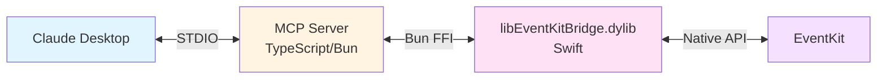

# ADR 0002: TypeScript + Bun FFI para Bridge con EventKit

**Estado:** Aceptado

**Fecha:** 2025-12-19

**Decisores:** Equipo de desarrollo

**Relacionado con:** [ADR 0001](./0001-use-native-eventkit-integration.md) (Usar Integración Nativa con EventKit)

---

## Contexto

En [ADR 0001](./0001-use-native-eventkit-integration.md) decidimos usar integración nativa con EventKit. Ahora debemos decidir cómo implementar esa integración:

1. **¿En qué lenguaje implementar el servidor MCP?**
   - Swift puro (acceso directo a EventKit)
   - TypeScript/Bun (stack original del PRD)

2. **Si usamos TypeScript, ¿cómo comunicarnos con EventKit?**
   - Bun FFI (Foreign Function Interface)
   - Proceso Swift separado con IPC (stdin/stdout)

## Decisión

**Implementar el servidor MCP en TypeScript/Bun y usar Bun FFI nativo para comunicarse con un módulo Swift compilado como biblioteca dinámica (.dylib).**

## Arquitectura

## Justificación

### Por qué TypeScript/Bun (vs Swift Puro)

| Factor | TypeScript/Bun | Swift Puro |
|--------|----------------|------------|
| Ecosistema MCP | ✅ SDK bien documentado | ❌ Menos soporte |
| Experiencia del equipo | ✅ Alta | ⚠️ Media |
| Flexibilidad futura | ✅ Fácil agregar integraciones | ⚠️ Más limitado |
| Debugging | ✅ Herramientas maduras | ⚠️ Menos familiar |
| Complejidad | ⚠️ Requiere bridge | ✅ Directo |

**Veredicto:** Las ventajas de mantener TypeScript superan la complejidad del bridge.

### Por qué Bun FFI (vs Proceso Separado)

| Factor | Bun FFI | Proceso Separado (IPC) |
|--------|---------|------------------------|
| Performance | ✅ Llamadas directas (~μs) | ❌ Overhead de IPC |
| Complejidad | ✅ Un solo proceso | ❌ Dos procesos, serialización |
| Sincronía | ✅ Llamadas síncronas simples | ⚠️ Async obligatorio |
| Aislamiento de fallas | ❌ Crash afecta todo | ✅ Procesos aislados |
| Soporte en Bun | ✅ Feature nativo | ⚠️ Implementación manual |

**Veredicto:** Bun FFI es suficientemente robusto y significativamente más simple.

## Opciones Consideradas

### Opción A: Swift Puro ❌ (Rechazada)

Implementar todo el servidor MCP en Swift, accediendo directamente a EventKit.

**Por qué se rechazó:**
- Menor experiencia del equipo en Swift
- El SDK MCP para TypeScript está mejor documentado
- Menor flexibilidad para futuras integraciones

**Podría reconsiderarse si:** El bridge FFI resulta demasiado complejo en práctica.

---

### Opción B: TypeScript + Proceso Swift Separado ❌ (Rechazada)

Servidor MCP en TypeScript comunicándose con un proceso Swift helper via stdin/stdout.

**Por qué se rechazó:**
- Overhead de IPC y serialización JSON
- Complejidad de manejar dos procesos
- Más puntos de falla

**Podría reconsiderarse si:** Necesitamos mayor aislamiento de fallas.

---

### Opción C: TypeScript + Bun FFI ✅ (Seleccionada)

Servidor MCP en TypeScript llamando a funciones Swift via Bun FFI.

**Por qué se seleccionó:**
- Mejor balance entre simplicidad y performance
- Un solo proceso, sin IPC
- FFI es feature de primera clase en Bun

## Consecuencias

### Positivas

1. ✅ Mantenemos TypeScript como lenguaje principal del proyecto
2. ✅ Performance excelente (llamadas FFI en microsegundos)
3. ✅ Arquitectura simple de un solo proceso
4. ✅ Aprovechamos ecosistema MCP de TypeScript

### Negativas

1. ❌ Dos lenguajes para mantener (TypeScript + Swift)
2. ❌ Build process más complejo (compilar .dylib antes de ejecutar)
3. ❌ Debugging cross-language es más difícil
4. ❌ Crashes en Swift afectan todo el proceso

### Neutral

1. 📝 Requiere macOS para desarrollo y ejecución
2. 📝 Requiere Xcode Command Line Tools instalado

## Riesgos y Mitigaciones

| Riesgo | Probabilidad | Impacto | Mitigación |
|--------|--------------|---------|------------|
| Crashes en Swift afectan todo | Media | Alto | Testing exhaustivo, manejo robusto de errores |
| Memory leaks en FFI boundary | Media | Medio | Liberar strings consistentemente, tests de memoria |
| Dificultad para debug | Alta | Bajo | Logs exhaustivos, tests unitarios por capa |

## Métricas de Éxito

1. ✅ Latencia de llamadas FFI <1ms
2. ✅ No memory leaks en tests de larga duración
3. ✅ Build reproducible en CI/CD
4. ✅ Cobertura de tests >80% en ambas capas

## Referencias

- [Bun FFI Documentation](https://bun.sh/docs/api/ffi)
- [Swift C Interoperability](https://developer.apple.com/documentation/swift/c-interoperability)
- [ADR 0001: Integración Nativa con EventKit](./0001-use-native-eventkit-integration.md)

## Historial de Cambios

- 2025-12-19: Limpieza del ADR - código de implementación movido al PRD
- 2025-12-19: Decisión inicial de usar TypeScript + Bun FFI bridge
