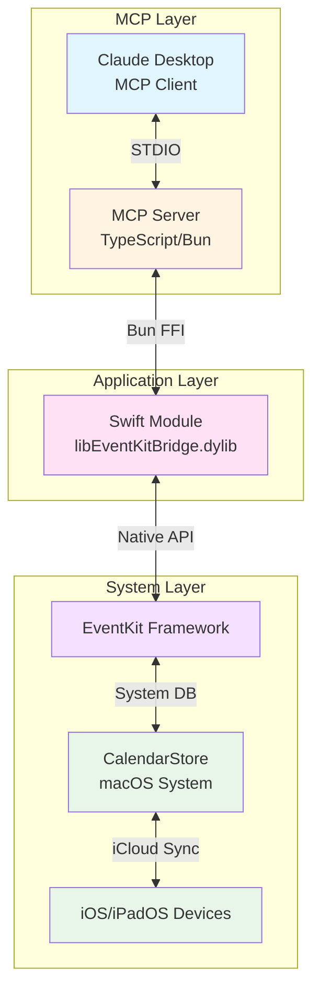
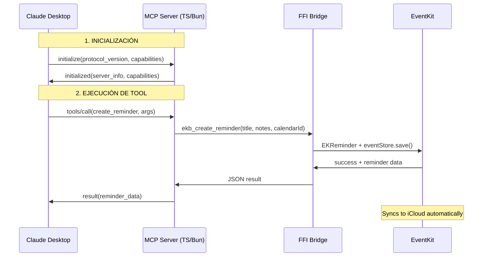

# Product Requirements Document (PRD)
## MCP Server EventKit - Native Reminders Integration

---

## 1. Visión General

**EventKit MCP Server** es un servidor de Model Context Protocol (MCP) que proporciona integración nativa con el framework EventKit de Apple, permitiendo a Claude gestionar recordatorios directamente en la aplicación Reminders de macOS/iOS. Los recordatorios creados a través de Claude se reflejan inmediatamente en el sistema y se sincronizan automáticamente con iCloud.

### Problema a Resolver
Los usuarios necesitan una forma eficiente de gestionar recordatorios a través de Claude con sincronización real con el ecosistema Apple:
- Crear recordatorios que aparezcan en Reminders.app de macOS/iOS
- Sincronización automática con iCloud y todos los dispositivos Apple
- Aprovechamiento de notificaciones nativas, Siri, y widgets
- Soporte completo de recurrencias y alarmas del sistema

### Decisiones Arquitectónicas Clave

> **ADR 0001**: Usar integración nativa con EventKit en lugar de base de datos standalone
> 
> **ADR 0002**: Implementar servidor en TypeScript/Bun con bridge FFI hacia módulo Swift

---

## 2. Objetivos del Proyecto

### Objetivos Principales
1. Implementar un servidor MCP en TypeScript con Bun siguiendo las mejores prácticas del SDK oficial
2. Integrar nativamente con EventKit de macOS para sincronización real con Reminders.app
3. Proporcionar operaciones CRUD completas sobre recordatorios del sistema
4. Soportar propiedades avanzadas: recurrencias, alarmas, prioridades

### Objetivos Secundarios
1. Sincronización bidireccional con cambios en Reminders.app
2. Búsqueda y filtrado avanzado
3. Soporte de múltiples listas/calendarios de recordatorios

### Restricciones de Plataforma
- **Solo macOS**: Requiere macOS 10.8+ con acceso a EventKit
- **Requiere permisos**: El usuario debe otorgar acceso a Reminders en Preferencias del Sistema

---

## 3. Arquitectura del Sistema

### Diagrama de Arquitectura



### Stack Tecnológico

| Componente | Tecnología | Propósito |
|------------|------------|-----------|
| Runtime | Bun 1.0+ | Ejecutar servidor MCP |
| Lenguaje Principal | TypeScript 5.0+ | Lógica del servidor MCP |
| Bridge | Bun FFI | Comunicación con Swift |
| Módulo Nativo | Swift | Acceso a EventKit |
| Framework MCP | `@modelcontextprotocol/sdk` | Protocolo MCP |
| Validación | Zod | Schemas de validación |
| Sistema | EventKit (macOS) | API de Reminders nativa |

---

## 4. Modelo de Datos (Basado en EKReminder)

### Reminder Object (mapeado desde EKReminder)

```typescript
interface Reminder {
  // Identificadores (de EventKit)
  id: string;                    // calendarItemIdentifier
  calendar_id: string;           // calendar.calendarIdentifier

  // Propiedades básicas (de EKCalendarItem)
  title: string;
  notes: string | null;
  created_at: string;            // creationDate
  updated_at: string;            // lastModifiedDate

  // Fechas (usando componentes como en EventKit)
  start_date_components: DateComponents | null;
  due_date_components: DateComponents | null;

  // Estado de completado
  completed: boolean;
  completion_date: string | null;

  // Prioridad (0 = sin prioridad, 1-4 = alta, 5 = media, 6-9 = baja)
  priority: number;

  // Recurrencia
  recurrence_rules: RecurrenceRule[] | null;

  // Alarmas
  alarms: Alarm[] | null;
}

interface DateComponents {
  year?: number;
  month?: number;      // 1-12
  day?: number;        // 1-31
  hour?: number;       // 0-23
  minute?: number;     // 0-59
  timezone?: string;   // IANA timezone
}

interface RecurrenceRule {
  frequency: 'daily' | 'weekly' | 'monthly' | 'yearly';
  interval: number;
  end_date?: string;
  days_of_week?: number[];   // 0-6
  days_of_month?: number[];  // 1-31
  months_of_year?: number[]; // 1-12
}

interface Alarm {
  trigger_offset_minutes: number;
  trigger_date?: string;
}

interface ReminderCalendar {
  id: string;          // calendarIdentifier
  title: string;
  color: string;       // hex color
  is_default: boolean; // defaultCalendarForNewReminders
}
```

---

## 5. Funcionalidades Principales

### 5.1 Tools (Herramientas MCP)

#### Recordatorios

| Tool | Descripción | Parámetros Clave |
|------|-------------|------------------|
| `create_reminder` | Crea recordatorio en EventKit | `title`, `calendar_id`, `notes`, `due_date_components`, `priority`, `recurrence_rules`, `alarms` |
| `list_reminders` | Lista recordatorios con filtros | `calendar_id`, `completed`, `from_date`, `to_date`, `priority_min`, `priority_max` |
| `get_reminder` | Obtiene recordatorio por ID | `reminder_id` |
| `update_reminder` | Actualiza recordatorio | `reminder_id`, + campos a actualizar |
| `delete_reminder` | Elimina recordatorio | `reminder_id` |
| `complete_reminder` | Marca como completado | `reminder_id`, `completion_date` |
| `uncomplete_reminder` | Marca como no completado | `reminder_id` |
| `search_reminders` | Búsqueda de texto | `query`, `search_in`, `completed` |

#### Calendarios/Listas

| Tool | Descripción | Parámetros Clave |
|------|-------------|------------------|
| `create_calendar` | Crea nueva lista | `title`, `color` |
| `list_calendars` | Lista todas las listas | - |
| `update_calendar` | Actualiza lista | `calendar_id`, `title`, `color` |
| `delete_calendar` | Elimina lista | `calendar_id`, `delete_reminders` |

### 5.2 Resources (Recursos MCP)

| Resource URI | Descripción |
|--------------|-------------|
| `reminder://{reminder_id}` | Recordatorio individual |
| `reminders://calendar/{calendar_id}` | Recordatorios de una lista |
| `reminders://today` | Recordatorios con vencimiento hoy |
| `reminders://upcoming` | Recordatorios próximos 7 días |
| `reminders://overdue` | Recordatorios vencidos |
| `reminders://completed` | Recordatorios completados |

---

## 6. Estructura del Proyecto

```
mcp-server-eventkit/
├── src/
│   ├── index.ts                    # Entry point MCP (STDIO)
│   ├── server.ts                   # Configuración McpServer
│   ├── tools/                      # Implementación de tools MCP
│   │   ├── reminders/
│   │   │   ├── create-reminder.ts
│   │   │   ├── list-reminders.ts
│   │   │   ├── get-reminder.ts
│   │   │   ├── update-reminder.ts
│   │   │   ├── delete-reminder.ts
│   │   │   ├── complete-reminder.ts
│   │   │   ├── uncomplete-reminder.ts
│   │   │   └── search-reminders.ts
│   │   ├── calendars/
│   │   │   ├── create-calendar.ts
│   │   │   ├── list-calendars.ts
│   │   │   ├── update-calendar.ts
│   │   │   └── delete-calendar.ts
│   │   └── index.ts
│   ├── resources/                  # Implementación de resources MCP
│   │   └── reminder-resources.ts
│   ├── swift-bridge/               # Bridge Swift via Bun FFI
│   │   ├── eventkit-bridge.ts     # TypeScript FFI bindings
│   │   ├── EventKitBridge.swift   # Implementación Swift
│   │   ├── EventKitBridge.h       # C header para FFI
│   │   └── build.sh               # Script compilación .dylib
│   ├── types/                      # Definiciones TypeScript
│   │   ├── reminder.ts
│   │   ├── calendar.ts
│   │   └── mcp.ts
│   ├── schemas/                    # Schemas Zod
│   │   ├── reminder-schema.ts
│   │   └── calendar-schema.ts
│   ├── utils/                      # Utilidades
│   │   ├── validation.ts
│   │   ├── date-helpers.ts
│   │   └── errors.ts
│   └── config.ts
├── build/                          # Binarios compilados
│   └── libEventKitBridge.dylib
├── tests/
│   ├── tools/
│   ├── swift-bridge/
│   └── utils/
├── adr/                            # Architecture Decision Records
│   ├── 0001-use-native-eventkit-integration.md
│   ├── 0002-typescript-with-bun-ffi-bridge.md
│   └── README.md
├── package.json
├── tsconfig.json
├── bunfig.toml
├── PRD.md
└── README.md
```

---

## 7. Comunicación MCP

### Transporte: STDIO

El servidor usa STDIO transport para comunicación directa proceso-a-proceso:
- Rendimiento óptimo sin overhead de red
- No requiere autenticación (comunicación local segura)
- Integración nativa con Claude Desktop

### Diagrama de Secuencia



### Configuración en Claude Desktop

**macOS**: `~/Library/Application Support/Claude/claude_desktop_config.json`

```json
{
  "mcpServers": {
    "eventkit": {
      "command": "bun",
      "args": ["run", "/ruta/absoluta/mcp-server-eventkit/src/index.ts"]
    }
  }
}
```

---

## 8. Bridge Swift (Bun FFI)

### Estructura del Bridge

El bridge permite llamadas síncronas desde TypeScript hacia Swift mediante Bun FFI:

```typescript
// TypeScript (eventkit-bridge.ts)
import { dlopen, FFIType, suffix } from "bun:ffi";

const lib = dlopen(libPath, {
  ekb_create_reminder: {
    args: [FFIType.cstring, FFIType.cstring, FFIType.cstring],
    returns: FFIType.cstring,
  },
  // ... otros símbolos
});
```

```swift
// Swift (EventKitBridge.swift)
@_cdecl("ekb_create_reminder")
public func createReminder(
    title: UnsafePointer<CChar>,
    notes: UnsafePointer<CChar>?,
    calendarId: UnsafePointer<CChar>
) -> UnsafePointer<CChar>? {
    let eventStore = EKEventStore()
    let reminder = EKReminder(eventStore: eventStore)
    // ... implementación
}
```

### Compilación

```bash
# build.sh
swiftc -emit-library \
    -o build/libEventKitBridge.dylib \
    src/swift-bridge/EventKitBridge.swift \
    -module-name EventKitBridge
```

---

## 9. Requisitos del Sistema

### Permisos Requeridos

El servidor solicita acceso a Reminders en primera ejecución:

```swift
let eventStore = EKEventStore()
eventStore.requestAccess(to: .reminder) { granted, error in
    // Handle permission result
}
```

**Configuración del usuario:**
- System Preferences > Security & Privacy > Privacy > Reminders
- Otorgar acceso a la aplicación terminal o Claude Desktop

### Requisitos de Desarrollo

- macOS 10.8+
- Bun 1.0+
- Swift toolchain (Xcode Command Line Tools)
- Node.js (opcional, para compatibilidad)

---

## 10. Implementación Paso a Paso

### Fase 1: Setup
1. Inicializar proyecto Bun
2. Configurar TypeScript
3. Crear estructura de carpetas
4. Setup del bridge Swift básico

### Fase 2: Bridge Swift
1. Implementar EventKitBridge.swift con funciones C-compatible
2. Crear header C para FFI
3. Configurar script de compilación
4. Implementar bindings TypeScript

### Fase 3: Tools MCP
1. Implementar tools CRUD de reminders
2. Implementar tools de calendars
3. Conectar tools con bridge FFI
4. Validación con Zod

### Fase 4: Resources y Testing
1. Implementar resources MCP
2. Tests unitarios por capa
3. Tests de integración

### Fase 5: Pulido
1. Manejo robusto de errores
2. Documentación completa
3. Optimizaciones

---

## 11. Criterios de Éxito

### Funcionalidad
- ✅ Recordatorios creados desde Claude aparecen en Reminders.app
- ✅ Cambios en Reminders.app son visibles para Claude
- ✅ Sincronización con iCloud funciona automáticamente
- ✅ Todas las propiedades de EKReminder se mapean correctamente

### Calidad
- ✅ Cobertura de tests >80%
- ✅ Todos los inputs validados con Zod
- ✅ Manejo robusto de errores
- ✅ Documentación completa

### Performance
- ✅ Llamadas FFI <1ms
- ✅ Operaciones EventKit <100ms
- ✅ Sin memory leaks

---

## 12. Referencias

### Decisiones Arquitectónicas
- [ADR 0001: Integración Nativa con EventKit](./adr/0001-use-native-eventkit-integration.md)
- [ADR 0002: TypeScript + Bun FFI Bridge](./adr/0002-typescript-with-bun-ffi-bridge.md)

### Documentación Técnica
- [EventKit Framework - Apple Developer](https://developer.apple.com/documentation/eventkit)
- [EKReminder Class Reference](https://developer.apple.com/documentation/eventkit/ekreminder)
- [Bun FFI Documentation](https://bun.sh/docs/api/ffi)
- [MCP TypeScript SDK](https://github.com/modelcontextprotocol/typescript-sdk)
- [Model Context Protocol Specification](https://modelcontextprotocol.io/)
